# **Solution Architecture Document**

**AI-Powered Social Support Platform**

Enterprise GenAI Solution Architecture

October 2025

GovDigital AI Factory | Abu Dhabi, UAE

# **1. Executive Summary**

## **1.1 Strategic Vision**

This document presents a comprehensive solution architecture for transforming the government's social support services from a manual, 20-day process into an AI-driven platform capable of processing applications in under 2 minutes with 99% automation.

**Mission:** Design an enterprise-grade, GenAI-powered platform that provides rapid, fair, and transparent financial support to citizens while setting a new global standard for public sector digital transformation.

## **1.2 Current State Analysis**

**The existing system suffers from critical deficiencies:**

* **Data Silos & Manual Ingestion:** Fragmented data across physical documents requiring error-prone manual entry  
* **Lack of Integrated Validation:** Only basic field validations with manual cross-referencing by case officers  
* **Fragmented Workflows:** Sequential reviews across departments creating severe bottlenecks  
* **Inconsistent Decision-Making:** Human subjectivity introduces bias and unfair outcomes

## **1.3 Key Architectural Principles**

The platform is built on six foundational principles:

1. **Zero Trust Security Architecture:** Continuous verification, AES-256 encryption, mTLS, no implicit trust  
2. **Multi-Agent AI System:** Five specialized agents with Plan-and-Solve and Reflexion frameworks  
3. **Event-Driven Architecture:** Apache Kafka with KRaft mode, Saga pattern, asynchronous processing  
4. **Hybrid Cloud Deployment:** On-premise for sensitive data, Azure for scalable workloads  
5. **Explainable AI (XAI):** Human-readable explanations with full data lineage traceability  
6. **Continuous Learning:** Human-in-the-loop feedback with weekly model fine-tuning

## **1.4 Expected Outcomes**

| Metric | Current State | Target State |
| ----- | :---: | :---: |
| Processing Time | 20 days | **< 2 minutes** |
| Automation Rate | 5% | **99%** |
| Decision Consistency | Low (Manual) | **High (AI-driven)** |
| Citizen Satisfaction | 35% | **> 90%** |

# **2. Architecture Diagrams**

The architecture follows the C4 model to provide multiple levels of abstraction from system context to detailed components.

## **2.1 System Context Diagram**

**Purpose:** Shows the system in its environment with external actors and systems

**Key Elements:**

**Primary Users:**

* Citizens: Submit applications via UAE Pass authentication, track status, chat with AI assistant  
* Case Officers: Review flagged cases via Government LDAP + MFA, approve/decline with structured rationale  
* System Administrators: Manage infrastructure via YubiKey + OTP, monitor system health

**External System Integrations:**

* National ID Service: REST API with OAuth2, real-time identity verification  
* Credit Bureau: REST API with mTLS, credit reports and financial history  
* Banking APIs (Open Banking): OAuth2-secured APIs for income and account verification  
* Job Portals: REST APIs for employment matching based on skills  
* Upskilling Platforms: REST APIs for personalized course recommendations

```mermaid
%%{init: {'theme':'base', 'themeVariables': { 'primaryColor':'#E8F4F8','primaryTextColor':'#1a1a1a','primaryBorderColor':'#2E75B5','lineColor':'#5B9BD5','secondaryColor':'#F5F5F5','tertiaryColor':'#FFF'}}}%%
graph TB
    subgraph ext[" "]
        direction TB
        style ext fill:#F8FAFB,stroke:#90A4AE,stroke-width:2px
        user1["👤 Citizen<br/><small>Submits applications</small>"]
        user2["👨‍💼 Case Officer<br/><small>Reviews applications</small>"]
        user3["⚙️ System Admin<br/><small>Manages platform</small>"]
    end
    
    subgraph core[" "]
        direction TB
        style core fill:#E3F2FD,stroke:#1976D2,stroke-width:3px
        platform["<b>AI-POWERED SOCIAL SUPPORT PLATFORM</b><br/><br/>Application Processing • AI Decision Engine<br/>Document Management • Case Tracking<br/>Economic Enablement • 24/7 Chatbot"]
    end
    
    subgraph apis[" "]
        direction TB
        style apis fill:#F5F5F5,stroke:#757575,stroke-width:2px
        api1["🆔 National ID<br/><small>Identity verification</small>"]
        api2["💳 Credit Bureau<br/><small>Financial history</small>"]
        api3["🏦 Banking APIs<br/><small>Income verification</small>"]
        api4["💼 Job Portals<br/><small>Employment matching</small>"]
        api5["📚 Training Platforms<br/><small>Skill development</small>"]
    end
    
    user1 -->|Submit & Track| platform
    user2 -->|Review & Decide| platform
    user3 -->|Monitor & Manage| platform
    
    platform -->|Verify| api1
    platform -->|Check| api2
    platform -->|Validate| api3
    platform -->|Match| api4
    platform -->|Recommend| api5
    
    style user1 fill:#BBDEFB,stroke:#1976D2,stroke-width:2px
    style user2 fill:#BBDEFB,stroke:#1976D2,stroke-width:2px
    style user3 fill:#BBDEFB,stroke:#1976D2,stroke-width:2px
    style platform fill:#1976D2,stroke:#0D47A1,stroke-width:3px,color:#fff
    style api1 fill:#E0E0E0,stroke:#616161,stroke-width:1px
    style api2 fill:#E0E0E0,stroke:#616161,stroke-width:1px
    style api3 fill:#E0E0E0,stroke:#616161,stroke-width:1px
    style api4 fill:#E0E0E0,stroke:#616161,stroke-width:1px
    style api5 fill:#E0E0E0,stroke:#616161,stroke-width:1px
```



## **2.2 Container Diagram**

**Purpose:** Shows the high-level technology choices and how containers communicate

**Key Containers:**

1. **Presentation Layer Containers**  
   * Next.js Web Application: Citizen portal (TypeScript, React)  
   * Streamlit Dashboard: Officer HITL interface (Python)  
   * AI Chatbot Service: 24/7 support using Claude Sonnet 4.5 (Python, FastAPI)  
2. **API Gateway Layer**  
   * Kong Enterprise: API management with security enforcement  
3. **Microservices Layer (Python FastAPI, Node.js)**  
   * Ingestion Service,   
   * Document Processing Service,   
   * Eligibility Service,   
   * Decision Engine  
   * Integration Orchestrator,   
   * Notification Service  
4. **AI/LLM Infrastructure**  
   * Llama 3 70B (vLLM + GPU): On-premise sensitive data processing  
   * GPT-5 (Azure OpenAI): Cloud-based complex reasoning  
   * Claude Sonnet 4.5: Agentic workflows and chatbot  
   * LangGraph: Multi-agent orchestration framework  
5. **Data Layer**  
   * PostgreSQL 16+ with pgvector: Primary datastore with vector search  
   * Neo4j Enterprise: Knowledge graph for relationship analysis  
   * Redis Enterprise: Caching and session management  
   * MinIO: S3-compatible object storage for documents  
6. **Event Streaming**  
   * Apache Kafka with KRaft: Event bus (5 brokers, 3x replication)  
7. **Security Layer**  
   * Keycloak: Identity and Access Management  
   * HashiCorp Vault: Secrets management with dynamic credentials  
   * Istio Service Mesh: mTLS between all services  
8. **Observability Layer**  
   * ELK Stack: Centralized logging (required for compliance)  
   * Prometheus + Grafana: Metrics and visualization  
   * Jaeger: Distributed tracing  
   * Langfuse: LLM-specific observability


## **2.3 Component Diagram**

**Purpose:** Detailed breakdown of components within each container

**Decision Engine Microservice Components:**

* Agent Orchestrator: LangGraph state machine managing agent transitions  
* Document Intelligence Module: Azure Doc Intelligence + LayoutLM + Tesseract OCR  
* Fact Verification Module: Cross-references data from external sources  
* Knowledge Graph Query Engine: Cypher query execution against Neo4j  
* LLM Reasoning Module: Multi-LLM coordination with Plan-and-Solve framework  
* XAI Explanation Generator: Creates human-readable decision explanations  
* Confidence Scorer: Calculates decision confidence (0-100%)  
* Economic Enablement Module: Job matching and upskilling recommendations

**Integration Orchestrator Components:**

* API Client Manager: Connection pooling and lifecycle management  
* Circuit Breaker Module: Resilience4j implementation with fallback strategies  
* Retry Engine: Exponential backoff with jitter  
* Response Cache Manager: Redis integration for temporary caching  
* Rate Limiter: Token bucket algorithm implementation

**Security Components (Cross-cutting):**

* JWT Validator: Token verification and claims extraction  
* RBAC Enforcer: Role-based access control checks  
* Audit Logger: Immutable audit trail to S3 WORM storage  
* Encryption Service: Field-level encryption using Vault Transit engine  
* Input Sanitizer: XSS and SQL injection prevention


# **3. Infrastructure & DevSecOps**

## **3.1 Hybrid Cloud Architecture**

The platform leverages a strategic hybrid cloud model optimizing for security, compliance, and scalability.

| On-Premise Infrastructure | Azure Cloud Infrastructure |
| ----- | ----- |
| Sensitive citizen data (PII) Decision processing Llama 3 70B (on-premise LLM) PostgreSQL primary database Neo4j knowledge graph Kafka event streaming | Anonymized LLM calls (GPT-5) Scalable compute resources Backup and disaster recovery Azure Kubernetes Service (AKS) Azure Monitor integration Azure Blob Storage (cold tier) |

**Connectivity Architecture:**

* **Azure ExpressRoute:** Dedicated 10 Gbps connection with 99.95% SLA  
* **IPsec VPN:** Redundant backup connectivity with automatic failover  
* **Private Endpoints:** All Azure services accessible only via private network  
* **Network Segmentation:** VLANs isolating data, application, and management planes

## **3.2 Kubernetes Architecture**

**Container Orchestration:** Kubernetes 1.29+ managed by Rancher RKE2 for hybrid cloud operations

### **Cluster Configuration**

* **3 Master Nodes:** HA etcd cluster, API server load balancing, admission controllers  
* **17 Worker Nodes:** 10 CPU-intensive, 4 GPU-enabled (NVIDIA A100), 6 data-intensive  
* **Storage:** Ceph distributed storage with CSI driver, automatic PV provisioning


### **Namespace Organization**

1. **frontend:** Next.js (3 pods), Streamlit (2 pods), Chatbot (3 pods)  
2. **api:** Kong (3 pods)  
3. **services:** Ingestion, Document, Eligibility, Decision, Integration, Notification (2-5 pods each)  
4. **ai:** Llama 3 70B with vLLM (2 GPU pods), Embedding service (2 pods), LangGraph (3 pods)  
5. **data:** PostgreSQL (3 pods), Neo4j (5 pods), Redis (3 pods), MinIO (4 pods)  
6. **events:** Kafka (5 brokers with KRaft), Schema Registry (2 pods)  
7. **security:** Keycloak (2 pods), Vault (3 pods), Cert Manager  
8. **observability:** Prometheus, Grafana, ELK Stack (3 nodes), Jaeger, Langfuse

### **Auto-Scaling Strategy**

* **Horizontal Pod Autoscaler (HPA):** CPU > 70% OR Memory > 80%, min 2 pods, max 10 pods  
* **Vertical Pod Autoscaler (VPA):** Automatically adjusts CPU/memory requests based on usage patterns  
* **Cluster Autoscaler:** Adds/removes nodes based on pending pods (2-5 min scale-up, 10 min scale-down)  
* **Custom Metrics:** Kafka lag, LLM queue depth, database connection pool

## **3.3 DevSecOps, CI/CD, and Deployment Strategy**

The AI-Powered Social Support Platform follows a DevSecOps-first approach, embedding security, automation, and observability across the delivery pipeline to ensure rapid, reliable, and compliant deployments.

### **Continuous Integration & Delivery Pipeline**

All application components—microservices, web apps, and AI models—are deployed through an automated GitLab CI/CD pipeline integrated with Terraform and Kubernetes.

```mermaid
%%{init: {'theme':'base', 'themeVariables': { 'primaryColor':'#E8F4F8','primaryTextColor':'#1a1a1a','primaryBorderColor':'#2E75B5','lineColor':'#5B9BD5','fontSize':'14px'}}}%%
graph LR
    dev["👨‍💻 Developer<br/><small>Git Commit & Push</small>"]
    build["🔨 Build & Test<br/><small>Unit + Integration Tests</small>"]
    security["🛡️ Security Scan<br/><small>SAST + DAST + Dependency Scan</small>"]
    deploy["🚀 Deploy<br/><small>Dev → Staging → Prod</small>"]
    monitor["📊 Monitor<br/><small>ELK • Prometheus • Grafana</small>"]

    dev --> build --> security --> deploy --> monitor
```



### **Pipeline Overview**

| Stage | Key Activities | Tools |
| ----- | ----- | ----- |
| **Build & Test** | Install dependencies, run unit/integration tests (min 70% coverage), static code analysis | Docker, npm, pip, PyTest, Jest, ESLint |
| **Security Scan** | Perform vulnerability scans, detect secrets, container image scanning | Snyk, Trivy, GitLab SAST/DAST |
| **Deploy** | Automated deployment to dev and staging; manual approval for production | GitLab CI/CD, Terraform, Helm, Kubernetes |
| **Monitor** | Centralized logging, tracing, and AI observability | ELK Stack, Prometheus, Grafana, Langfuse |

### **Infrastructure as Code (IaC)**

All infrastructure is defined and version-controlled through Terraform for consistent, repeatable deployments across environments.

**Scope includes:**
- Kubernetes clusters (RKE2 / AKS)
- PostgreSQL and Redis instances
- Network and IAM configuration (Keycloak, Vault)
- Monitoring stack (Prometheus, ELK)

This ensures environment parity and reduces human error during provisioning.

### **Deployment Strategy**

The platform uses a **Blue-Green Deployment** model to achieve zero downtime during releases.

- **Blue environment:** currently serving production traffic
- **Green environment:** new version deployed and validated
- Upon successful smoke tests, traffic is switched to Green via Istio VirtualService routing

For critical AI model updates, a lightweight **Gradual Deployment** is supported:
- New model serves 10% of requests for 24 hours
- Promoted manually if accuracy and latency meet defined thresholds

**Rollback:** If deployment health checks fail (error rate > 0.1%, latency spike > 50%), the pipeline automatically reverts to the previous stable version.

### **Monitoring and Observability**

- **Logs:** Centralized in ELK Stack for audit and compliance
- **Metrics:** Collected via Prometheus and visualized in Grafana dashboards
- **Traces:** Captured through Jaeger for distributed tracing
- **AI Observability:** Key metrics like LLM response time, confidence scores, and error rates monitored via Langfuse


# **4. Zero Trust Security Architecture (Enhanced)**

## **4.1 Zero Trust Security Architecture**

Advanced protection with multi-layered security zones implementing Zero Trust principles: continuous verification, least privilege access, and assume breach mentality.

```mermaid
%%{init: {'theme':'base', 'themeVariables': { 'primaryColor':'#E8F4F8','primaryTextColor':'#1a1a1a','primaryBorderColor':'#2E75B5','lineColor':'#5B9BD5'}}}%%
graph TB
    subgraph users["EXTERNAL USERS"]
        cit["👤 Citizen<br/><small>UAE Pass</small>"]
        off["👨‍💼 Case Officer<br/><small>Gov LDAP + MFA</small>"]
        adm["⚙️ Admin<br/><small>YubiKey + OTP</small>"]
    end
    
    subgraph dmz["TRUST BOUNDARY 1: DMZ ZONE<br/><small>First Line of Defense</small>"]
        kong2["Kong API Gateway<br/><br/>✓ JWT Validation<br/>✓ Rate Limiting (1000/min)<br/>✓ Request Sanitization<br/>✓ DDoS Protection<br/>✓ WAF Integration"]
    end
    
    subgraph iam["IDENTITY & ACCESS MANAGEMENT"]
        kc["Keycloak (REQUIRED)<br/><small>Federation Hub</small><br/><br/>✓ UAE Pass (Citizen)<br/>✓ Gov LDAP (Officers)<br/>✓ OAuth2 / OIDC<br/>✓ RBAC Enforcement<br/>✓ Session Management"]
    end
    
    subgraph app["TRUST BOUNDARY 2: APPLICATION ZONE<br/><small>mTLS Encrypted - Istio Service Mesh</small>"]
        services["Microservices<br/><br/>↕ Mutual TLS ↕<br/><br/>✓ Certificate-based auth<br/>✓ Zero trust between services<br/>✓ Service identity<br/>✓ Encrypted traffic"]
        
        aiservices["AI Services<br/><small>On-Premises</small><br/><br/>✓ Llama 3 70B<br/>✓ LangGraph<br/>✓ Embeddings"]
        
        vault2["HashiCorp Vault<br/><small>Sidecar Pattern</small><br/><br/>✓ Dynamic secrets<br/>✓ DB credentials rotation<br/>✓ API key management"]
    end
    
    subgraph datazone["TRUST BOUNDARY 3: DATA ZONE<br/><small>HIGHEST SECURITY - Private Subnet</small>"]
        direction TB
        
        pg2[("PostgreSQL 16<br/><small>AES-256 TDE<br/>+ Field-level encryption<br/>National ID • Bank Accounts</small>")]
        
        neo2[("Neo4j Cluster<br/><small>REQUIRED<br/>AES-256 at Rest<br/>Encrypted Backups</small>")]
        
        minio2[("MinIO<br/><small>REQUIRED<br/>AES-256 per Object<br/>Sensitive Documents</small>")]
        
        security["<b>Data Security Controls:</b><br/><br/>✓ Field-level encryption (PII)<br/>✓ Private subnet (no internet)<br/>✓ Immutable audit logs (S3 WORM)<br/>✓ Zero trust verification<br/>✓ Data classification enforced<br/>✓ 7-year retention (compliance)"]
    end
    
    subgraph llmsec["LLM SECURITY CONTROLS"]
        llmfw["<b>LLM Firewall:</b><br/><br/>✓ Prompt injection detection<br/>✓ Input sanitization<br/>✓ Output filtering (PII removal)<br/>✓ Rate limiting per user<br/>✓ Anomaly detection<br/>✓ Model inversion protection"]
    end
    
    cit -->|TLS 1.3| kong2
    off -->|TLS 1.3| kong2
    adm -->|TLS 1.3| kong2
    
    kong2 --> kc
    kc --> services
    kc --> aiservices
    
    vault2 -.->|Inject Secrets| services
    vault2 -.->|Inject Secrets| aiservices
    
    services -->|TLS + Auth| pg2
    services -->|TLS + Auth| neo2
    services -->|TLS + Auth| minio2
    
    aiservices -->|TLS + Auth| pg2
    aiservices -->|TLS + Auth| neo2
    
    aiservices --> llmfw
    
    pg2 --> security
    neo2 --> security
    minio2 --> security
    
    style dmz fill:#FFEBEE,stroke:#C62828,stroke-width:4px
    style iam fill:#FFF3E0,stroke:#EF6C00,stroke-width:3px
    style app fill:#E8F5E9,stroke:#2E7D32,stroke-width:4px
    style datazone fill:#F3E5F5,stroke:#6A1B9A,stroke-width:5px
    style llmsec fill:#FCE4EC,stroke:#C2185B,stroke-width:3px
    
    style kong2 fill:#EF5350,stroke:#C62828,stroke-width:3px,color:#fff
    style kc fill:#FFB74D,stroke:#EF6C00,stroke-width:3px
    style services fill:#66BB6A,stroke:#2E7D32,stroke-width:2px,color:#fff
    style aiservices fill:#81C784,stroke:#388E3C,stroke-width:2px,color:#fff
    style vault2 fill:#90A4AE,stroke:#455A64,stroke-width:2px
    style pg2 fill:#AB47BC,stroke:#6A1B9A,stroke-width:3px,color:#fff
    style neo2 fill:#9575CD,stroke:#5E35B1,stroke-width:3px,color:#fff
    style minio2 fill:#8E24AA,stroke:#6A1B9A,stroke-width:3px,color:#fff
    style security fill:#CE93D8,stroke:#7B1FA2,stroke-width:2px
    style llmfw fill:#F48FB1,stroke:#AD1457,stroke-width:2px
```



## **4.2 LLM-Specific Security Measures**

Advanced protection against AI/LLM-specific threats including prompt injection, model inversion, and data poisoning.

### **Prompt Injection Mitigation**

**Threat:** Malicious users crafting inputs to manipulate LLM behavior or extract sensitive information

**Defense Mechanisms:**

1. **Input Sanitization Layer**  
   1. Remove special characters: brackets, quotes, escape sequences  
   2. Length limits: 5,000 characters for text fields, 10MB for documents  
   3. Content-type validation: Verify file MIME types match extensions  
2. **Prompt Guardrails**  
   1. System prompt isolation: User inputs never modify system instructions  
   2. Structured prompt templates: Predefined formats with validated placeholders  
   3. Intent classification: Pre-LLM filter flags suspicious patterns  
3. **Output Filtering**  
   1. PII detection: Regex patterns for SSN, credit cards, national IDs  
   2. Sensitive data masking: Replace detected PII with [REDACTED]  
   3. Hallucination detection: Compare outputs against source documents  
4. **LLM Firewall (LlamaGuard 2)**  
   1. Pre-processing: Analyze inputs for jailbreak attempts  
   2. Post-processing: Verify outputs don't contain harmful content  
   3. Rate limiting per user: 100 requests/hour, 1,000 tokens/request

### **Model Inversion & Data Poisoning Protection**

* **Training Data Isolation:** Fine-tuning datasets stored in encrypted, air-gapped environment  
* **Input Validation for Training:** Human review of all officer feedback before model fine-tuning  
* **Differential Privacy:** Add noise to training data to prevent information leakage  
* **Model Versioning & Rollback:** All model versions retained for 90 days with instant rollback

## **4.2 Data Classification & Governance**

Comprehensive data classification scheme ensuring appropriate security controls are applied based on data sensitivity levels, aligned with national data protection regulations.

### **Data Classification Matrix**

| Classification Level | Data Examples | Security Controls | Access Requirements | Retention Policy |
|---------------------|---------------|-------------------|---------------------|------------------|
| **🔴 RESTRICTED** | • National ID numbers<br/>• Bank account details<br/>• Biometric data<br/>• Social security numbers | • AES-256 TDE (Transparent Data Encryption)<br/>• Field-level encryption with Vault Transit<br/>• Private subnet (no internet access)<br/>• Immutable audit logs (S3 WORM)<br/>• Encryption key rotation (90 days) | • MFA + YubiKey required<br/>• Need-to-know basis only<br/>• Admin role + explicit approval<br/>• All access logged to ELK | 7 years (compliance)<br/>After: Secure deletion with crypto-shredding |
| **🟠 CONFIDENTIAL** | • Income details<br/>• Employment history<br/>• Family composition<br/>• Asset declarations<br/>• Address information | • AES-256 encryption at rest<br/>• TLS 1.3 in transit<br/>• Masked in UI (last 4 digits)<br/>• PII detection filters<br/>• Role-based access control | • MFA required<br/>• Case Officer role minimum<br/>• Access logged and monitored<br/>• Quarterly access reviews | 5 years<br/>After: Anonymization for analytics |
| **🟡 INTERNAL** | • Application status<br/>• Decision history<br/>• AI confidence scores<br/>• Officer notes<br/>• Processing metadata | • TLS 1.3 encryption<br/>• Database access controls<br/>• RBAC enforcement<br/>• Session management | • SSO (Keycloak) required<br/>• Valid employee credentials<br/>• Appropriate role assignment | 3 years<br/>After: Archive to cold storage |
| **🟢 PUBLIC** | • Job listings<br/>• Training courses<br/>• Public announcements<br/>• Help documentation<br/>• System status | • Standard TLS encryption<br/>• CDN caching allowed<br/>• Rate limiting (DDoS protection) | • No authentication required<br/>• Public internet access<br/>• Anonymous usage allowed | Indefinite<br/>Or until business need ends |

### **Data Handling Requirements by Classification**

**RESTRICTED Data Processing Rules:**
* ✅ **MUST** be processed on-premises only (no cloud)
* ✅ **MUST** use dedicated GPU nodes for AI processing (Llama 3 70B)
* ✅ **MUST** be anonymized/pseudonymized before any cloud API calls (GPT-5, Claude)
* ✅ **MUST** have end-to-end encryption throughout the data lifecycle
* ✅ **MUST** support "right to be forgotten" with crypto-shredding of encryption keys

**CONFIDENTIAL Data Processing Rules:**
* ⚠️ **MAY** be processed in cloud if anonymized (remove PII identifiers)
* ⚠️ **REQUIRES** encryption in-memory during processing
* ⚠️ **REQUIRES** secure deletion after use (no persistent storage in logs)

**Data Lineage & Provenance:**
* Every RESTRICTED/CONFIDENTIAL data point tagged with: `source_system`, `classification_level`, `access_timestamp`, `processed_by_user_id`
* Full audit trail stored in ELK Stack with 7-year retention (immutable)
* Data lineage tracking for compliance reporting

### **PII Detection & Masking Strategy**

**Automated PII Detection using Microsoft Presidio:**
* **Pattern Matching:** Regex patterns for National IDs, credit cards, bank accounts, phone numbers
* **Named Entity Recognition (NER):** Detect names, addresses, organizations using transformer models
* **Custom Entity Types:** Abu Dhabi-specific formats (UAE National ID, Emirates ID)

**Masking Rules:**
* **Logs & Error Messages:** Replace detected PII with `[REDACTED]` or hashed token
* **User Interfaces:** Display only last 4 digits (e.g., `**** **** **** 1234`)
* **Analytics Datasets:** Pseudonymization using consistent hashing (SHA-256 with salt)

### **Compliance Alignment**

* **GDPR Article 32:** Technical measures for data security ✅  
* **UAE Federal Data Protection Law:** Personal data protection requirements ✅  
* **ISO 27001:** Information security management standards ✅  
* **NIST Cybersecurity Framework:** Risk-based security controls ✅

## **4.3 API Security Deep Dive**

**Kong API Gateway Configuration:**

* **Authentication:** JWT validation with RS256 signatures, 15-minute token expiry  
* **Authorization:** RBAC with fine-grained permissions (read, write, admin)  
* **Rate Limiting:** 100 req/min per user, 1000 req/min per service, sliding window  
* **Request Validation:** JSON schema validation against OpenAPI 3.0 specs  
* **Response Filtering:** PII masking in error messages and logs  
* **Circuit Breaker:** Open after 5 consecutive failures, prevent cascading failures

# **5. Data & Integration Architecture**

## **5.1 Event-Driven Architecture**

Event-driven architecture using Apache Kafka with KRaft mode for decoupled, asynchronous, and scalable microservices communication.


### **Kafka Topics:**

| Topic | Purpose |
| ----- | ----- |
| **application.submitted** | Citizen submits new application |
| **document.processed** | Document extraction completed |
| **data.enriched** | External data integration completed |
| **eligibility.assessed** | AI eligibility assessment completed |
| **decision.made** | Final decision (AI or human) made |
| **notification.required** | Citizen notification needs to be sent |
| **feedback.received** | Case officer provides correction/feedback |

### **API Contract Management & Standards**

**OpenAPI 3.0 Specification:** All APIs documented using OpenAPI 3.0 standard for contract-first development

**API Design Principles:**
* **RESTful Architecture:** Follow REST maturity model (Richardson Level 2+)
* **Resource-Oriented URLs:** `/api/v1/applications/{id}` not `/api/v1/getApplication`
* **HTTP Verbs:** GET (read), POST (create), PUT (update), PATCH (partial update), DELETE (remove)
* **Versioning Strategy:** URL path versioning (`/api/v1/`, `/api/v2/`) with 12-month deprecation notice
* **Standard Status Codes:** 200 (OK), 201 (Created), 400 (Bad Request), 401 (Unauthorized), 404 (Not Found), 500 (Server Error)

**Request/Response Standards:**
* **Content-Type:** `application/json` (default), `application/xml` (legacy support)
* **Pagination:** Cursor-based for large datasets (`?cursor=xyz&limit=50`)
* **Filtering:** Query parameters (`?status=pending&created_after=2024-01-01`)
* **Sorting:** `?sort=created_at:desc`
* **Rate Limiting Headers:** `X-RateLimit-Limit`, `X-RateLimit-Remaining`, `X-RateLimit-Reset`

**Error Response Format (RFC 7807):**
```json
{
  "type": "/errors/validation-error",
  "title": "Validation Failed",
  "status": 400,
  "detail": "National ID format is invalid",
  "instance": "/api/v1/applications/abc123",
  "trace_id": "7d9e8f1a-b2c3-4d5e-6f7a-8b9c0d1e2f3a",
  "invalid_fields": [
    {
      "field": "national_id",
      "message": "Must be 15 digits",
      "code": "INVALID_FORMAT"
    }
  ]
}
```

**API Gateway Policies (Kong):**
* **Request Validation:** JSON Schema validation against OpenAPI spec before reaching backend
* **Response Transformation:** Strip sensitive fields (e.g., internal IDs) from responses
* **CORS:** Configured per-API (citizen portal vs officer dashboard)
* **Idempotency:** Idempotency-Key header support for POST/PUT operations

**API Catalog & Discovery:**
* **Developer Portal:** Kong Dev Portal with interactive API documentation (Swagger UI)
* **API Registry:** Centralized catalog with ownership, SLA, and deprecation status
* **Automated SDK Generation:** Generate client libraries (Python, TypeScript, Java) from OpenAPI specs

## **5.2 External System Integration**

The platform integrates with multiple internal and external systems using resilient integration patterns:

**Real-Time API Integrations:**

* National ID Service: REST API with OAuth2, verifies citizen identity (95% accuracy)  
* Credit Bureau: REST API with mTLS, fetches credit reports and financial history  
* Banking APIs (Open Banking): OAuth2-secured APIs for income verification  
* Job Portal APIs: REST APIs for job recommendations  
* Upskilling Platform: REST APIs for course recommendations

**Batch Processing Integrations:**

* Department of Economic Development: Nightly SFTP batch reconciliation  
* Data Warehouse: Daily CDC (Change Data Capture) via Kafka Connect

**Integration Patterns:**

* Circuit Breaker: Resilience4j for fault tolerance (open after 5 failures)  
* Retry with Backoff: Exponential backoff (1s, 2s, 4s, 8s, 16s)  
* Timeout: 5-second timeout for real-time APIs, 60-second for batch  
* Caching: Redis caching for credit reports (24-hour TTL), job listings (1-hour TTL)

## **5.3 Data Lineage & Provenance Tracking**

Comprehensive tracking of data flow from source to decision for auditability and compliance.

### **Lineage Architecture**

1. **Source Tracking**  
   1. Every data point tagged with: source system, document ID, page number, timestamp  
   2. Example: 'income_value': 50000, 'source': 'bank_statement', 'doc_id': 'BS-2024-001', 'page': 3  
   3. External API responses cached with correlation ID linking to request  
2. **Transformation Tracking**  
   1. Each data transformation logged: service, timestamp, transformation type  
   2. Example: OCR extraction, currency normalization, address standardization  
   3. Transformation rules versioned and linked to outputs  
3. **Decision Traceability**  
   1. Every AI decision includes: model version, input data references, confidence score  
   2. Full audit trail stored in immutable S3 WORM storage for 7 years  
   3. Ability to reconstruct exact decision reasoning from archived artifacts

### **Implementation: Data Lineage Tracking**

* **Metadata Repository:** PostgreSQL stores entities, relationships, lineage data  
* **Kafka Integration:** Event hooks capture automatic lineage data  
* **Visualization:** Custom dashboard provides lineage graphs from source to decision  
* **API Access:** REST API for programmatic lineage queries by case officers

# **6. Advanced AI Agentic System**

The heart of the platform is a sophisticated multi-agent AI system that collaborates to process applications with high accuracy and explainability.

## **6.1 Multi-Agent Collaboration Workflow**

Comprehensive workflow illustrating how five specialized AI agents collaborate to process applications with Knowledge Graph reasoning, multi-LLM coordination, and Human-in-the-Loop feedback for continuous improvement.


## **6.2 Explainable AI (XAI) - Enhanced**

Every AI decision includes a human-readable explanation that references specific criteria, data points, and reasoning process.

**XAI Implementation Approach:**

* **Technique:** Prompt engineering with LLM to generate explanations that cite specific data sources. For structured models (e.g., eligibility scoring), use SHAP values for feature importance.  
* **Validation:** Human evaluators rate explanation quality monthly (clarity, accuracy, completeness). Target: 85%+ satisfaction score.  
* **Citizen-Facing Format:** Explanations written at 8th-grade reading level, avoiding jargon. Technical details available in expandable sections.

**Example Explanation:**

"Application recommended for approval with 92% confidence. Monthly income of AED 3,500 (verified via bank statements) falls below the AED 5,000 threshold. Family size of 4 members qualifies for support. No assets exceeding AED 100,000 were identified. Minor discrepancy in reported address (form vs credit report) was resolved by prioritizing credit bureau data."

## **6.3 Human-in-the-Loop & Continuous Learning**

Not all decisions are auto-approved. Low-confidence cases (<90%) are routed to case officers for review via the Streamlit dashboard. Officer feedback creates a continuous learning loop:

**HITL Process:**

* Step 1: Flag for Review (Decision engine sends application to dashboard)  
* Step 2: Officer Review (Dashboard displays AI recommendation, evidence, confidence)  
* Step 3: Human Decision (Officer makes final decision with rationale)  
* Step 4: Feedback Collection (Decision + rationale captured in structured format)  
* Step 5: Model Fine-Tuning (Weekly batch fine-tuning using validated feedback data)

**Continuous Learning:**

* Data Collection: Store officer decisions + rationales in training dataset  
* Weekly Fine-Tuning: Fine-tune Llama 3 70B model with new data (LoRA or QLoRA)  
* A/B Testing: Compare new model vs current model (10% traffic to new)  
* Promotion: If new model improves accuracy by >5%, promote to production

## **6.4 Model Versioning, Registry & Lifecycle Management**

Comprehensive MLOps strategy ensuring reproducibility, traceability, and safe deployment of AI models throughout their lifecycle.

### **ML Model Registry - MLflow**

**Centralized Model Repository:** MLflow Tracking Server for all model artifacts, metadata, and lineage

**Model Registry Structure:**
```
model://social-support-llm/
├── llama-3-70b-base/
│   ├── v1.0.0 (production) - Baseline model
│   ├── v1.1.0 (staging) - Fine-tuned with 500 officer corrections
│   └── v1.2.0 (development) - Experimental LoRA adapter
├── document-intelligence/
│   ├── layoutlm-v3 (production)
│   └── azure-doc-intel-2024-01 (production)
├── embeddings/
│   └── bge-large-en-v1.5 (production)
└── eligibility-scorer/
    ├── xgboost-v2.3 (production)
    └── neural-net-v1.0 (archived)
```

**Model Metadata Tracking:**
* **Training Metadata:** Dataset version, hyperparameters, training duration, GPU hours
* **Performance Metrics:** Accuracy, precision, recall, F1-score, confidence distribution
* **Data Lineage:** Training data sources, preprocessing steps, feature engineering
* **Dependencies:** Python packages (requirements.txt), CUDA version, framework versions
* **Model Signature:** Input/output schema (JSON Schema) for validation

### **Model Versioning Strategy**

**Semantic Versioning (SemVer):** `MAJOR.MINOR.PATCH`
* **MAJOR:** Breaking changes (API signature change, complete retraining)
* **MINOR:** Backwards-compatible improvements (fine-tuning, accuracy boost)
* **PATCH:** Bug fixes, configuration changes

**Model Stages:**
1. **Development:** Experimental models, active development
2. **Staging:** Passed validation tests, ready for A/B testing
3. **Production:** Actively serving traffic, fully validated
4. **Archived:** Deprecated but retained for 90 days (compliance)

**Model Transition Workflow:**
```
Development → (Unit Tests + Validation) → Staging → (A/B Test 10% traffic)
    → (Metrics Review) → Production → (Monitor 7 days) → Archived (old version)
```

### **A/B Testing & Model Promotion**

**Gradual Deployment Strategy:**
* **Phase 1 (10% traffic):** New model serves 10% of applications for 24 hours
* **Metrics Comparison:** Accuracy, latency (P95), confidence scores, HITL rate
* **Success Criteria:**
  * Accuracy improvement ≥ 3% (e.g., 92% → 95%)
  * Latency increase ≤ 15% (acceptable tradeoff)
  * HITL rate decrease ≥ 2% (fewer escalations = better confidence)
  * No critical errors or failures

**Manual Promotion Pipeline:**
```python
# Pseudo-code for model promotion logic
if new_model.accuracy > current_model.accuracy + 0.03:
    if new_model.p95_latency < current_model.p95_latency * 1.15:
        if new_model.error_rate < 0.001:
            # Manual approval required
            request_approval_for_promotion(new_model)
        else:
            rollback_to_current(current_model)
            notify_ml_team("High error rate detected")
```

**Rollback Strategy:**
* **Instant Rollback:** Switch traffic back to previous production model (< 2 minutes)
* **Triggers:** Error rate >0.1%, latency spike >50%, manual intervention
* **Preserved State:** Previous model kept in "production-backup" stage for 7 days

### **Model Monitoring & Drift Detection**

**Data Drift Detection:**
* **Feature Distribution:** Monitor input feature distributions (KL divergence)
* **Concept Drift:** Track decision distribution changes over time
* **Alert Threshold:** KL divergence > 0.15 triggers retraining workflow

**Model Performance Degradation:**
* **Confidence Decay:** If avg confidence drops below 85% for 7 days → retrain
* **HITL Rate Increase:** If HITL rate increases >15% → investigate data shift
* **Accuracy Monitoring:** Weekly accuracy audits on labeled validation set

**Shadow Mode Testing:**
* New models run in shadow mode (results not used) for validation
* Compare shadow predictions vs actual officer decisions
* Minimum 1000 shadow predictions required before staging promotion

### **Model Reproducibility**

**Every model training run captures:**
* Git commit SHA of training code
* Random seeds for reproducibility
* Full hyperparameter configuration (YAML)
* Training data snapshot (S3 URI with version)
* Docker image tag for training environment

**Example Model Card (MLflow):**
```yaml
model_name: llama-3-70b-social-support
version: v1.1.0
framework: transformers==4.35.0
base_model: meta-llama/Llama-3-70b-hf
training_method: LoRA (r=16, alpha=32)
training_data: s3://models/training-data-2024-10-15.parquet
training_samples: 2,500 officer-validated corrections
training_duration: 6.5 hours on 4x A100 GPUs
accuracy: 94.2% (+3.1% vs v1.0.0)
avg_confidence: 88.7%
hitl_rate: 8.3% (-2.4% vs v1.0.0)
deployment_date: 2024-10-23
deployed_by: ml-ops-pipeline
approval: signed_by_lead_ml_engineer
```

### **Model Governance & Compliance**

**Model Audit Trail:**
* Every model deployment logged to ELK Stack (immutable)
* Decision provenance: trace every AI decision to exact model version
* Compliance requirement: 7-year retention of model artifacts

**Model Access Control:**
* **Read Access:** All ML engineers can view model metadata
* **Deploy to Staging:** ML Engineers + approval from tech lead
* **Deploy to Production:** Requires approval from 2 senior engineers + automated checks pass

## **6.5 Data Quality Strategy - Enhanced**

Government data is inherently messy. The system must handle incomplete, corrupted, or low-quality inputs gracefully:

**Validation Rules:**

* Mandatory fields: Name, National ID, address, declared income  
* Format checks: National ID format, date formats, numeric ranges  
* Cross-field consistency: If employed, require resume; if assets declared, require proof

**Quality Thresholds:**

* OCR confidence <85% → Flag for manual verification  
* Missing mandatory documents → Auto-reject with notification to resubmit  
* Corrupted PDF/unreadable → Request citizen to re-upload

**Fallback Mechanisms:**

* If fact-checking API down (credit bureau) → Queue for retry (max 3 attempts)  
* If retry fails → Route to human case officer with note about missing data

# **7. Disaster Recovery & Business Continuity**

## **7.1 Recovery Objectives**

* **Recovery Time Objective (RTO):** 4 hours maximum downtime  
* **Recovery Point Objective (RPO):** 15 minutes maximum data loss  
* **Availability SLA:** 99.9% uptime (43.2 minutes downtime/month allowed)

## **7.2 Backup Strategy**

### **Database Backups**

* **PostgreSQL:** Continuous WAL archiving + daily full backups, point-in-time recovery  
* **Neo4j:** Daily full graph backups, incremental transaction logs every 6 hours  
* **Redis:** RDB snapshots every 6 hours + AOF persistence  
* **Retention:** 7 daily, 4 weekly, 12 monthly, 7 yearly backups

### **Application & Configuration Backups**

* **Kubernetes Etcd:** Hourly snapshots with Velero, stored in Azure Blob  
* **Kafka Topics:** MirrorMaker2 replication to DR cluster  
* **Docker Images:** All images replicated to Azure Container Registry

## **7.3 Disaster Recovery Architecture**

**DR Site:** Secondary datacenter 50km from primary, fully equipped infrastructure

### **Replication Strategy**

* **Database:** PostgreSQL streaming replication, Neo4j causal clustering  
* **Object Storage:** MinIO active-active replication, 30-second lag  
* **Kafka:** Cross-cluster replication to DR Kafka cluster  
* **Kubernetes:** Standby cluster with dormant nodes, activates on failover

### **Failover Process**

5. **Detection:** Automated health checks every 30 seconds detect primary site failure  
6. **Activation:** DR team notified, initiate failover runbook (manual approval required)  
7. **DNS Update:** Update Route 53 to point to DR site (5-minute TTL)  
8. **Database Promotion:** Promote replicas to primary, verify data consistency  
9. **Application Start:** Scale up Kubernetes pods in DR cluster  
10. **Verification:** Smoke tests confirm all services operational

**Estimated Failover Time:** 2-3 hours (well within 4-hour RTO)

### **Testing & Drills**

* **Quarterly DR Drills:** Full failover test with simulated disasters  
* **Monthly Backup Restores:** Verify backup integrity by restoring to test environment  
* **Chaos Engineering:** Regular chaos experiments with tools like Chaos Mesh
